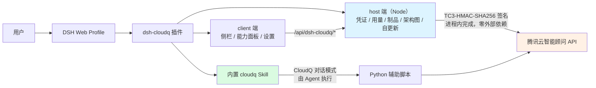

# dsh-cloudq

[](https://www.npmjs.com/package/dsh-cloudq)
[](https://www.npmjs.com/package/dsh-cloudq)
[](https://www.npmjs.com/package/dsh-cloudq)
[](LICENSE)

[English](README.md) | 简体中文

面向 [DeepSeek Harness](https://github.com/deepseek-ai/deepseek-harness) 的 CloudQ 集成插件。插件为 Web Profile 提供 CloudQ 模式，内置 `cloudq` Skill，并提供 CloudQ 用量、架构视图、本地凭证配置和插件管理能力。

## 演示


## 环境要求

- Node.js `>=22.19.0`
- DeepSeek Harness `0.1.1-rc.2` 或兼容的更高 `0.1.x` 版本
- `dsh plugin` 命令可调用 `pnpm`
- macOS、Linux 或 Windows
- 可选：CloudQ 对话模式由内置 Skill 驱动，需可通过 `python3` 命令运行 Python 3；设置、用量、灵感、制品、架构图等面板功能不依赖 Python

## 安装

```sh
dsh plugin --profile web add dsh-cloudq
```

安装完成后重启 Web Profile：

```sh
dsh --profile web
```

打开 DSH 输出的访问地址，即可在对话输入区和侧边栏看到 CloudQ 入口。也可以通过 `/cloudq` 显式调用内置 Skill。

## 升级与卸载

```sh
dsh plugin --profile web update dsh-cloudq
dsh plugin --profile web remove dsh-cloudq
```

修改已安装的插件后，需要重启 Web Profile。

## 使用步骤

1. 打开 **设置 → 插件**，展开 **CloudQ** 卡片。
2. 填入腾讯云 `SecretId` 和 `SecretKey`（可前往 [访问密钥控制台](https://console.cloud.tencent.com/cam/capi) 获取）。
3. 点击 **测试连接** 验证密钥，再点击 **保存配置**；卡片显示 **AKSK有效** 即配置成功。
4. 在对话输入区点击 **进入 CloudQ 模式**（或输入 `/cloudq`），即可开始提问，例如「帮我看看系统有哪些风险」。

## 工作原理



## 凭证配置

设置卡片支持配置腾讯云 `SecretId` 和 `SecretKey` 凭证。

- 凭证保存在本机 `~/.tencent-cloudq/credential.json`，文件权限仅允许当前用户访问。
- 面板接口在 Host 进程内完成签名与调用（Node 原生实现），凭证不经过任何子进程，不会出现在进程列表中。
- 浏览器接口仅返回凭证状态和脱敏标识，不返回凭证内容或本地凭证路径。
- 可通过退出登录操作删除本地凭证。

请遵循最小权限原则，只授予 CloudQ 操作所需的权限。内置 Skill 可以调用云管理的读写操作，请在批准前检查每项操作的具体内容。

## 安全机制

- Host API 只接受来自回环地址的同源请求。
- JSON 请求体大小限制为 64 KiB。
- 非预期的内部错误不会返回到浏览器。
- 远程数据通过 DOM 文本节点渲染，不使用 HTML 注入。
- 下载链接必须使用 HTTPS。
- npm 包不包含凭证、Token 或本地环境文件。

如需报告安全问题，请通过 [GitHub Issues](https://github.com/TencentCloud/cloudq-for-dsh/issues) 提交，且不要附带真实凭证。

## 常见问题

**装/更新不到最新版本？（供应链 24 小时冷却期）**

pnpm 11 默认只安装发布满 24 小时的版本。刚发版后请用显式版本号：

```sh
dsh plugin --profile web add dsh-cloudq@0.3.0
```

或等待冷却期结束，裸命令即可解析到最新版本。

**Windows 能用吗？需要装 Python 吗？**

能。设置、用量、灵感、制品、架构图等功能为 Node 原生实现，macOS / Linux / Windows 均**不需要 Python**。仅 **CloudQ 对话模式**由内置 Skill 驱动，需要 `python3`。

**AK/SK 存在哪里？安全吗？**

存于 `~/.tencent-cloudq/credential.json`（权限仅当前用户）。面板接口在进程内签名，凭证不经过子进程、不会出现在进程列表中。点「退出登录」即可删除。

**为什么点「测试连接」失败？**

0.3.0 起面板已不依赖 Python。若仍失败，请确认该密钥属于当前账号，且已为它开通智能顾问（CloudQ）。

## 本地开发

```sh
pnpm install
pnpm run lint
pnpm run typecheck
pnpm run test:all
pnpm run build
pnpm run check:client
npm pack --dry-run --registry=https://registry.npmjs.org/
```

npm 包内包含预构建的 Host 和 Web Client 产物、Bundle Patch、CloudQ 运行时图标以及内置 Skill。用户从 Registry 安装时不需要执行构建脚本。

## 目录结构

```text
src/                         Host 与 Web Client 源码
skills/cloudq/               内置 CloudQ Skill 与 Python 辅助脚本
assets/cloudq.png            Host 提供的运行时图标
scripts/                     构建和发布检查脚本
tests/                       单元测试、集成测试与包契约测试
cordis.patch.yml             DSH Bundle 配置层
```

## 发布

源码在 [TencentCloud/cloudq-for-dsh](https://github.com/TencentCloud/cloudq-for-dsh) 完成评审和版本管理。只有仓库检查与安装包冒烟测试全部通过后，才可将 npm 版本发布到官方 Registry。

## 更多文档

- 更新日志：[`CHANGELOG.md`](CHANGELOG.md)
- 开发与维护指南：[`DEVELOPMENT.md`](DEVELOPMENT.md)

## 许可证

本项目采用 MIT 许可证，详情请参阅 [`LICENSE`](LICENSE)。
