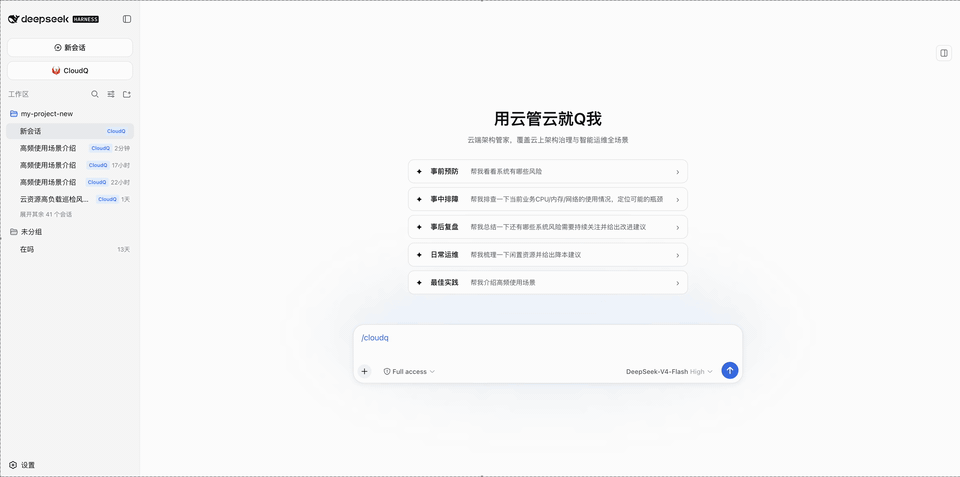
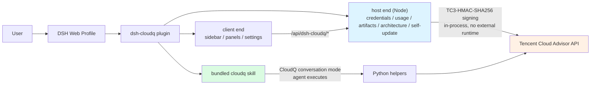

# dsh-cloudq

[](https://www.npmjs.com/package/dsh-cloudq)
[](https://www.npmjs.com/package/dsh-cloudq)
[](https://www.npmjs.com/package/dsh-cloudq)
[](LICENSE)

English | [简体中文](README-zh.md)

CloudQ integration for [DeepSeek Harness](https://github.com/deepseek-ai/deepseek-harness). It adds a CloudQ mode to the Web profile, bundles the `cloudq` skill, and provides CloudQ usage and architecture views, local credential setup, and plugin management.

## Demo



## Screenshots


## Requirements

- Node.js `>=22.19.0`
- DeepSeek Harness `0.1.1-rc.2` or a compatible newer `0.1.x` release
- `pnpm` available to the `dsh plugin` command
- macOS, Linux, or Windows
- Optional: the CloudQ conversation mode is driven by the bundled skill and needs Python 3 available as `python3`; the settings, usage, inspiration, artifact, and architecture panels do not require Python

## Install

```sh
dsh plugin --profile web add dsh-cloudq
```

Restart the Web profile after installation:

```sh
dsh --profile web
```

Open the URL printed by DSH. The conversation input area and sidebar will expose the CloudQ entry. You can also invoke the bundled skill explicitly with `/cloudq`.

## Upgrade and remove

```sh
dsh plugin --profile web update dsh-cloudq
dsh plugin --profile web remove dsh-cloudq
```

Restart the Web profile after changing the installed package set.

## Usage

1. Open **Settings → Plugins** and expand the **CloudQ** card.
2. Enter your Tencent Cloud `SecretId` and `SecretKey` (available from the [CAM console](https://console.cloud.tencent.com/cam/capi)).
3. Click **测试连接** to validate the pair, then **保存配置**. The card shows **AKSK有效** once the credential is active.
4. Click **进入 CloudQ 模式** in the conversation input area — or type `/cloudq` — and start asking cloud operations questions, e.g. “帮我看看系统有哪些风险”.

## How it works



## Credentials

The settings card accepts a Tencent Cloud `SecretId`/`SecretKey` pair.

- Credentials are stored locally at `~/.tencent-cloudq/credential.json` with owner-only permissions.
- Panel APIs sign and call Tencent Cloud in-process (native Node implementation); secrets never pass through any subprocess or appear in process lists.
- Browser APIs return only credential state and masked identifiers; local credential paths and secret values are not returned.
- Use the logout action to remove the stored credential.

Follow least-privilege: grant only the permissions required for the CloudQ operations you intend to run. The bundled skill can invoke read and write cloud-management operations; review each action before approving it.

## Security model

- Host APIs accept only loopback, same-origin requests.
- JSON request bodies are limited to 64 KiB.
- Unexpected internal errors are not returned to the browser.
- Remote values are inserted with DOM text nodes rather than HTML injection.
- Download links require HTTPS.
- No credentials, tokens, or local environment files are included in the npm package.

Report security issues through [GitHub Issues](https://github.com/TencentCloud/cloudq-for-dsh/issues) without including live credentials.

## FAQ

**Can't install or update to the latest version? (24-hour supply-chain cooling period)**

pnpm 11 only installs versions that have been published for at least 24 hours. Right after a release, pin the version explicitly:

```sh
dsh plugin --profile web add dsh-cloudq@0.3.0
```

or wait for the cooldown to expire and the bare command will resolve to the newest release.

**Does it work on Windows? Do I need Python?**

Yes. The settings, usage, inspiration, artifact, and architecture panels are a native Node implementation and need **no Python** on any of macOS / Linux / Windows. Only **CloudQ conversation mode** is driven by the bundled skill and requires `python3`.

**Where is my AK/SK stored? Is it safe?**

At `~/.tencent-cloudq/credential.json` (owner-only permissions). Panel APIs sign in-process; credentials never pass through a subprocess or appear in process lists. The **退出登录** action removes it.

**Why does 测试连接 fail?**

On 0.3.0+ the panels no longer depend on Python. If it still fails, make sure the key belongs to the current account and that Smart Advisor (CloudQ) is enabled for it.

## Development

```sh
pnpm install
pnpm run lint
pnpm run typecheck
pnpm run test:all
pnpm run build
pnpm run check:client
npm pack --dry-run --registry=https://registry.npmjs.org/
```

The npm package ships prebuilt Host and Web client artifacts, the bundle patch, the runtime logo, and the bundled skill. Registry installation runs no build scripts.

## Repository layout

```text
src/                         Host and Web client source
skills/cloudq/               Bundled CloudQ skill and Python helpers
assets/cloudq.png            Runtime logo served by the Host
scripts/                     Build and release checks
tests/                       Unit, integration, and package-contract tests
cordis.patch.yml             DSH bundle layer
```

## Release

Source is reviewed and versioned in [TencentCloud/cloudq-for-dsh](https://github.com/TencentCloud/cloudq-for-dsh). An npm version is published to the official registry only after the repository checks and the package-install smoke test pass.

## More documentation

- Changelog: [`CHANGELOG.md`](CHANGELOG.md)
- Development & maintenance guide: [`DEVELOPMENT.md`](DEVELOPMENT.md)

## License

MIT. See [`LICENSE`](LICENSE).
